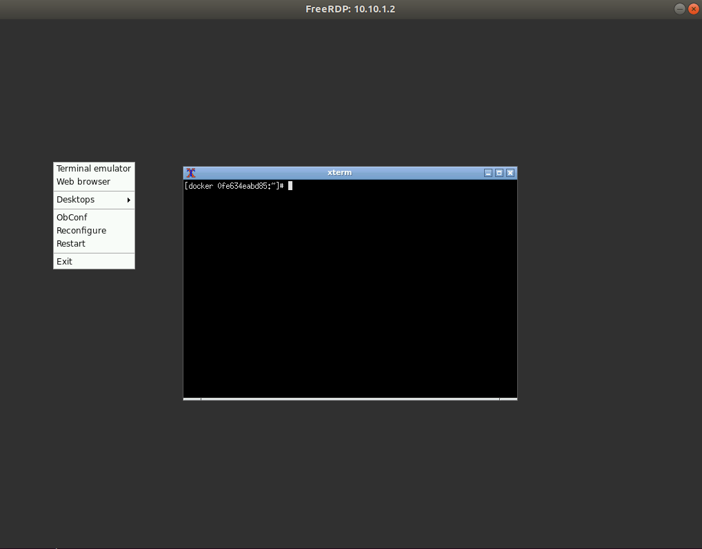

# docker-rdp

docker-ubuntu + docker-dotnet + rdp access, openbox window manager and an xterm

## build image

```
./build.sh
```

## run image

```
docker run -tid --name=myrdp searchathing/rdp
```

## set container root password

```
docker exec -ti myrdp passwd
```

## install rdp client

```
apt install freerdp2-x11
```

## test rdp connection

```
xfreerdp /v:containerip
```


